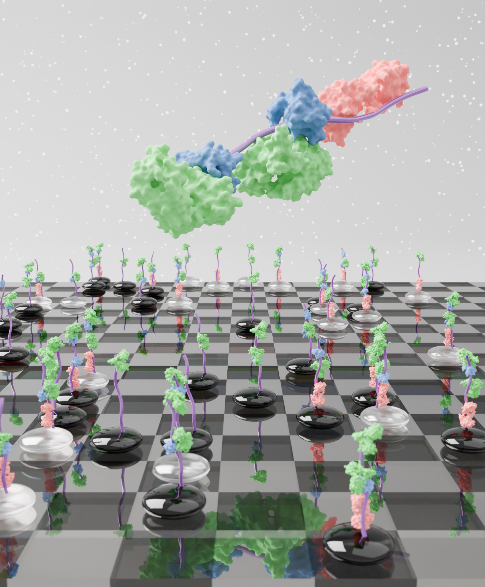
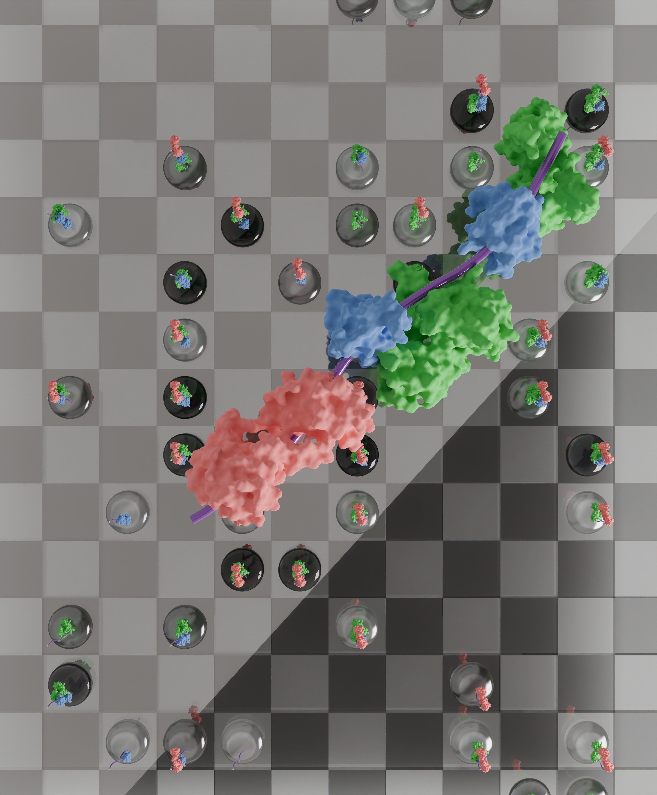

Hi there! In my free time I enjoy making scientific art work, and this is my personal gallery — a space to share my creative work and experiments in 3D art and design. I use digital tools such as <b>Blender 3D</b> to bring my ideas to life, from detailed models and animations to abstract visual explorations.
Take a look around, explore my projects, and feel free to reach out if you’d like to collaborate or just talk art and 3D!


  <video class="grid-w100 md:grid-w1080 xl:grid-w900" controls playsinline muted loop poster="gallery/poster.jpg">
    <source src="gallery/final_movie.mp4" type="video/mp4" />

    Sorry, your browser doesn’t support embedded videos.
  </video>
  
  


